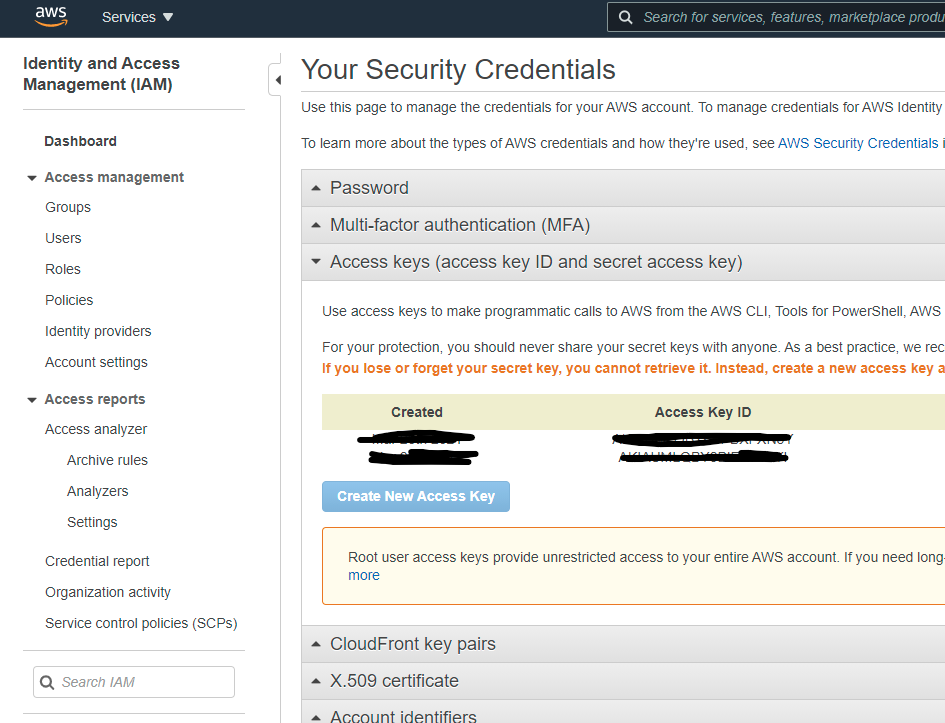

# TTS-IT

A **WINDOWS ONLY** interpreter that plays [AWS Polly]([https://link](https://aws.amazon.com/polly/))/[StreamLabs]([https://link](https://blog.streamlabs.com/how-to-add-text-to-speech-to-donations-to-your-stream-548e9908b451)) text-to-speech on [Soundpad]([https://link](https://leppsoft.com/soundpad/en/))

## Requirements

- [Soundpad]([https://link](https://leppsoft.com/soundpad/en/)) (Either steam version or DRM-Free should)
- An amazon AWS account
- [Python 3]([https://link](https://www.python.org/downloads/))

## How to use

- Download the repo
- `pip install boto3`
- Create an .ini file in the following format (preferably in the same folder)

  ```ini
  [Credentials]
  AccessKeyId = MY_AWS_ACCESS_KEY
  SecretKey = MY_AWS_SECRET_KEY
  ```
  if you don't have an AWS access key you can get one by [clicking this link]([https://link](https://console.aws.amazon.com/iam/home?#/security_credentials)) and creating a new key
  
- `py main.py credentials.ini`

## Commands

- `help`
  - shows a list of availible commands
- `quit`
  - quits
- `say {arg}`
  - Sends an API call to Polly to download the line and plays it through SoundPad
  - If no argument is provided the program will enter in "immediate say mode." You can leave it by pressing CTRL-C
- `search {arg}`
  - Search for voices that match argument
  - If no arguments is provided list all voices
- `set {arg}`
  - Sets the voice to closes match
  - If no argument is provided load the first voice in voices.json

